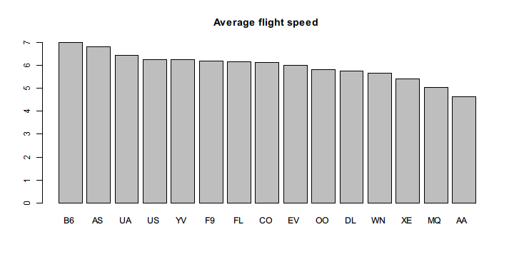
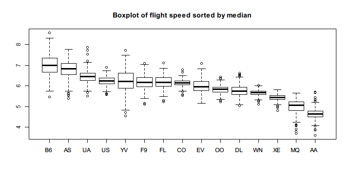

# dplyr

[dplyr](https://github.com/hadley/dplyr) is the next iteration of [plyr](https://github.com/hadley/plyr) that is specialized for processing data frames with blazing high performance.

It is by design pipe-friendly and imports `%>%` from magrittr. In this page, we demonstrate how we use pipeR's `%>>%` to work with dplyr and the `hflights` dataset.

First, you need to install the packages:

```r
install.packages(c("dplyr","hflights"))
```

`hflights` is a dataset contains information about flights that departed Houston in 2011. In the description the author writes:

> This dataset contains all flights departing from Houston airports IAH (George Bush Intercontinental) and HOU (Houston Hobby). The data comes from the Research and Innovation Technology Administration at the Bureau of Transporation statistics: http://www.transtats.bts.gov/DatabaseInfo.asp?DB_ID=120&Link=0

Having known what the data is all about, then we load the libraries and take a look at the structure of the data.


```r
library(dplyr)
library(pipeR)
library(hflights) # install.packages("hflights")
data(hflights)
```


```r
str(hflights)
```

```
# 'data.frame':	227496 obs. of  21 variables:
#  $ Year             : int  2011 2011 2011 2011 2011 2011 2011 2011 2011 2011 ...
#  $ Month            : int  1 1 1 1 1 1 1 1 1 1 ...
#  $ DayofMonth       : int  1 2 3 4 5 6 7 8 9 10 ...
#  $ DayOfWeek        : int  6 7 1 2 3 4 5 6 7 1 ...
#  $ DepTime          : int  1400 1401 1352 1403 1405 1359 1359 1355 1443 1443 ...
#  $ ArrTime          : int  1500 1501 1502 1513 1507 1503 1509 1454 1554 1553 ...
#  $ UniqueCarrier    : chr  "AA" "AA" "AA" "AA" ...
#  $ FlightNum        : int  428 428 428 428 428 428 428 428 428 428 ...
#  $ TailNum          : chr  "N576AA" "N557AA" "N541AA" "N403AA" ...
#  $ ActualElapsedTime: int  60 60 70 70 62 64 70 59 71 70 ...
#  $ AirTime          : int  40 45 48 39 44 45 43 40 41 45 ...
#  $ ArrDelay         : int  -10 -9 -8 3 -3 -7 -1 -16 44 43 ...
#  $ DepDelay         : int  0 1 -8 3 5 -1 -1 -5 43 43 ...
#  $ Origin           : chr  "IAH" "IAH" "IAH" "IAH" ...
#  $ Dest             : chr  "DFW" "DFW" "DFW" "DFW" ...
#  $ Distance         : int  224 224 224 224 224 224 224 224 224 224 ...
#  $ TaxiIn           : int  7 6 5 9 9 6 12 7 8 6 ...
#  $ TaxiOut          : int  13 9 17 22 9 13 15 12 22 19 ...
#  $ Cancelled        : int  0 0 0 0 0 0 0 0 0 0 ...
#  $ CancellationCode : chr  "" "" "" "" ...
#  $ Diverted         : int  0 0 0 0 0 0 0 0 0 0 ...
```

The data is tabular and very well fit in a data frame. Remarkably it has 227496 rows which is much larger than small datasets like `mtcars`.

Two columns in the data frame attracts our attention: `Distance` and `ActualElapsedTime`. If we divide `Distance` by `ActualElapsedTime` we can get the actual flight speed. Therefore, in this example, we use dplyr functions to transform the data in pipeline and see which carrier has faster flights.


```r
hflights %>>% 
  filter(Cancelled == 0) %>>%
  mutate(speed = Distance / ActualElapsedTime) %>>%
  (~ hflights2) %>>% # save to hflights2
  group_by(UniqueCarrier) %>>%
  summarize(mean_speed = mean(speed,na.rm = TRUE)) %>>%
  arrange(desc(mean_speed)) %>>%
  with(barplot(mean_speed,names.arg = UniqueCarrier,
    main = "Average flight speed"))
```



The code is quite straightforward and almost close to plain English. In fact, one of the merits of dplyr is that it defines a domain specific language tailored for the needs in data manipulation. `filter()`, `mutate()`, `group_by()`, `summarize()`, and unused `select()` are all *verb* functions defined as chainable data commands.

Since we only take the average flight speed for each carrier, the bar plot may be misleading without know their distributions. Therefore, we decide to draw a box plot that roughly show the quantiles and out-liers for each group.

However, the original data is not suitable for `boxplot()` which accepts a list of numeric vectors to form various boxes. Here we use [reshape2](https://github.com/hadley/reshape) package to transform the long format to wide format, that is, cast the data frame with a long list of ungrouped observations to one in which a particular value of the observations are grouped by column and arranged in rows.

We also use [rlist](http://renkun.me/rlist) to sort the data frame by column to make it easier to view the box plot.

Note that in the previous example, we have already saved the data with `speed` column to `hflights2` so that we don't have to recompute it again.


```r
library(reshape2)    # install.packages("reshape2")
library(rlist)       # install.packages("rlist")
hflights2 %>>% 
  dcast(Year + Month + DayofMonth ~ UniqueCarrier,
    value.var = "speed",fun.aggregate = mean) %>>%
  subset(select = c(-1,-2,-3)) %>>%
  (~ hflights3) %>>% # save the wide-format data
  list.sort(desc(median(.,na.rm = TRUE))) %>>%
  boxplot(main = "Boxplot of flight speed sorted by median")
```



Note that some carriers have stable speeds and others don't. To see it more clearly, we rearrange the columns by the standard deviation of each group.


```r
hflights3 %>>%
  list.sort(sd(.,na.rm = TRUE)) %>>%
  boxplot(main = "Boxplot of flight speed sorted by sd")
```


To build a better qualification standard, we can divide the mean by the standard deviation of the speed figures in each group.


```r
hflights3 %>>%
  list.sort(desc(mean(.,na.rm = TRUE) / sd(.,na.rm = TRUE))) %>>%
  boxplot(main = "Boxplot of flight speed sorted by mean/sd")
```


Note that for particular destination and origin, we can see which route is faster.


```r
hflights2 %>>%
  dcast(Dest ~ Origin, mean, na.rm = TRUE, value.var = "speed") %>>%
  na.omit %>>%
  filter(HOU > IAH) %>>%
  (Dest)
```

```
#  [1] "ABQ" "ATL" "AUS" "BHM" "BNA" "BWI" "CHS" "CRP" "DAL" "DEN" "DFW"
# [12] "ELP" "EWR" "FLL" "GSP" "HRL" "JAN" "JAX" "LAS" "LAX" "LIT" "MAF"
# [23] "MCI" "MCO" "MSY" "OKC" "PHL" "PHX" "SAN" "SAT" "STL" "TPA" "TUL"
```

The above results are the destination to which departing from HOU is on average faster than from IAH.

In your console, you can run the code above and reproduce the results by yourself. You can also run partial pipeline and see the intermediate results or you can insert some side effects to inspect the data.
