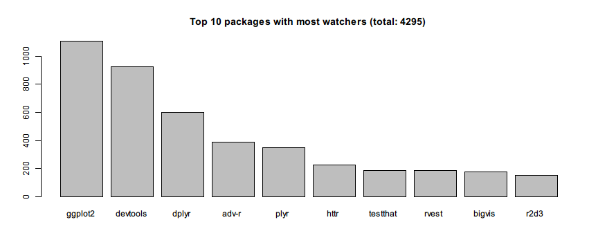
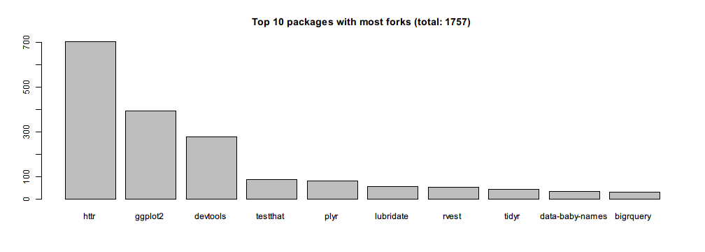

# rlist

[rlist](http://renkun.me/rlist) is a set of tools for working with list objects. Its goal is to make it easier to work with lists by providing a wide range of functions on non-tabular data stored in them.

Its design is very much like dplyr but rlist is focused at dealing with non-tabular data stored in JSON or YAML format which can be easily represented by list objects in R.

In this example, we will get to know more about [Hadley Wickham](https://github.com/hadley)'s contribution to R community from JSON data retrieved with [GitHub API](https://api.github.com) using rlist and pipeR.


```r
library(pipeR)
library(rlist) # devtools::install_github("rlist","renkun-ken")
repos <- "https://api.github.com/users/hadley/repos?per_page=100&page=%d" %>>%
  sprintf(1:2) %>>%
  list.load("json") %>>%
  list.ungroup
```

We have retrieved all the repositories of Hadley Wickham and put them into a list called `repos`. It includes rich information and can be fun to explore with. To know better about the data structure, visit [this page](https://api.github.com/users/hadley/repos) and you will get an impression on how the data is structured.

First, let's see the main languages of the repositories. 


```r
repos %>>%
  list.table(language) %>>%
  list.sort(-.)
```

```
# language
#          R       <NA>        C++ JavaScript          C        TeX 
#         95         13          9          8          6          5 
#       Ruby      Shell       HTML     Python      Rebol        CSS 
#          3          3          2          2          2          1 
#     Turing 
#          1
```

It is not surprising that most repo's main language is R. Then we can build a much longer pipeline to show the mostly watched active repos. Here we regard the repos updated in the last 30 days as active.


```r
repos %>>% 
  list.update(updated_at = updated_at %>>% 
      strptime("%Y-%m-%dT%H:%M:%SZ")) %>>%
  list.filter(updated_at >= as.POSIXct(Sys.Date() - 30)) %>>%
  (~ active_repos) %>>%
  list.sort(-watchers) %>>%
  list.take(10) %>>%
  list.select(name, watchers) %>>%
  list.stack %>>%
  (~ most_watched_repos) %>>%
  with(
    barplot(watchers,names.arg = name,
      main = "Top 10 packages with most watchers (total: %d)" %>>%
        sprintf(sum(watchers)))
    )
```



Then we can use similar way to see repos mainly written in R with most forks. Note that in the previous code, we save the filtered results to `active_repos` for further use so that we don't have to transform the data every time.


```r
active_repos %>>%
  list.filter(language == "R") %>>%
  list.sort(-forks) %>>%
  list.take(10) %>>%
  list.select(name, forks) %>>%
  list.stack %>>%
  with(
    barplot(forks,names.arg = name,
      main = "Top 10 packages with most forks (total: %d)" %>>%
        sprintf(sum(forks)))
    )
```



We are also interested in the repos whose name contains *plot* or *vis*. Let's see what they are arranged by popularity measured in count of stargazers.


```r
repos %>>% 
  list.filter(!fork) %>>%
  list.filter(grepl("plot|vis", name)) %>>%
  list.sort(-stargazers_count) %>>%
  list.mapv(name)
```

```
#  [1] "ggplot2"         "bigvis"          "ggplot2-book"   
#  [4] "productplots"    "boxplots-paper"  "lvplot"         
#  [7] "bigvis-infovis"  "densityvis"      "ggplot2-bayarea"
# [10] "toc-vis"         "lvplot-paper"    "prodplotpaper"  
# [13] "ggplot2-docs"    "vis-migration"   "imvisoned"
```

If you don't know much about Hadley's repos and heard a repo that sounds like *player*, you can filter the names by fuzzy searching using soundex measurement provided by [stringdist](https://github.com/markvanderloo/stringdist).


```r
repos %>>% 
  list.filter(!fork) %>>%
  list.filter(stringdist::stringdist("player", name, method = "soundex") == 0L) %>>%
  list.mapv(name)
```

```
# [1] "plyr"
```

Now we know that package is actually spelled as *plyr*.
