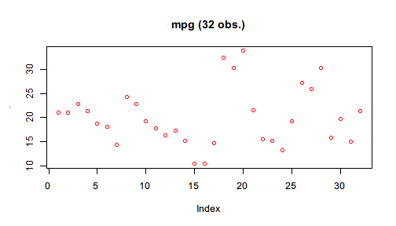

# Pipe to first argument

`Pipe()` creates a Pipe object that supports light-weight chaining with `$`. Basically, it is like a box containing a value and for this box `$` is defined to perform first-argument piping.

The example in the page that introduces the first-argument piping feature of `%>>%` can be translated using `Pipe()` and `$`:


```r
library(pipeR)
set.seed(123)
Pipe(rnorm(100, mean = 10))$
  log()$
  diff()$
  sample(size = 10000, replace = TRUE)$
  summary()
```

```
# $value : summaryDefault table 
# ------
#      Min.   1st Qu.    Median      Mean   3rd Qu.      Max. 
# -0.309500 -0.083720 -0.012360 -0.001854  0.071440  0.358400
```

You may notice that in the beginning of the pipeline, the numeric vector generated by `rnorm()` is converted to a `Pipe` object by `Pipe()`. Since `$` for `Pipe` object is defined for first-argument piping, the name following `$` will be interpreted to a function name, and then `()` will execute that function with the value in `Pipe` put to the first argument, and put the result into the next `Pipe` object. In this way, the pipeline continues chaining.

In other words, `Pipe(x)$f()` works like `Pipe(f(x))`, and `Pipe(x)$f(a)$g(b)` works like `Pipe(g(f(x,a),b))`, which can be further grown and become more nested if written without `$` chaining. 

Also note that the output does not look exactly the same with that produced by `%>>%` but with a header added on top of the summary table. Recall the version of code using the operator:


```r
set.seed(123)
rnorm(100, mean = 10) %>>%
  log %>>%
  diff %>>%
  sample(size = 10000, replace = TRUE) %>>%
  summary
```

```
#      Min.   1st Qu.    Median      Mean   3rd Qu.      Max. 
# -0.309500 -0.083720 -0.012360 -0.001854  0.071440  0.358400
```

In fact, the result produced by `Pipe()` is not really the summary table but a box (`Pipe` object) that contains it, and therefore the object can continue piping with `$`. `Pipe` object implements several generic functions to make it easier to inspect and manipulate the value in the box. To extract the inner value, call `$value`, or simply `[]` as shortcut.


```r
set.seed(123)
Pipe(rnorm(100, mean = 10))$
  log()$
  diff()$
  sample(size = 10000, replace = TRUE)$
  summary()$
  value
```

```
#      Min.   1st Qu.    Median      Mean   3rd Qu.      Max. 
# -0.309500 -0.083720 -0.012360 -0.001854  0.071440  0.358400
```

With `$value` in the end of the pipeline, `value` is extracted from the Pipe object, and this object is no longer a `Pipe` so that `$` won't pipe any more.

Here is another example that runs a linear regression with `mtcars`.


```r
Pipe(mtcars)$
  lm(formula = mpg ~ wt + cyl)
```

```
# $value : lm 
# ------
# 
# Call:
# lm(formula = mpg ~ wt + cyl, data = .)
# 
# Coefficients:
# (Intercept)           wt          cyl  
#      39.686       -3.191       -1.508
```

Use `[]` to extract the `lm` object inside the resulted `Pipe` object.


```r
Pipe(mtcars)$
  lm(formula = mpg ~ wt + cyl) []
```

```
# 
# Call:
# lm(formula = mpg ~ wt + cyl, data = .)
# 
# Coefficients:
# (Intercept)           wt          cyl  
#      39.686       -3.191       -1.508
```

The Pipe header no longer exists, which indicates that the value is extracted.

Just like `%>>%`, in the function call after `$` also supports `.` to represent the input value. For example,


```r
Pipe(mtcars$mpg)$
  plot(col = "red", main = sprintf("mpg (%d obs.)", length(.)))
```



[Option to turn off header]
