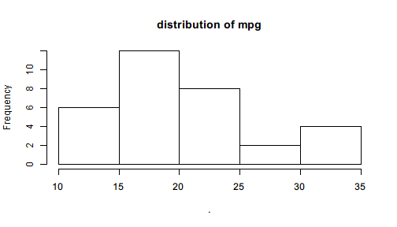

# Pipe to first argument

`Pipe()` creates a Pipe object that supports light-weight chaining with `$`. Basically, it is like a box containing a value and for this box `$` is defined to perform first-argument piping.

The example in the page that introduces the first-argument piping feature of `%>>%` can be translated using `Pipe()` and `$`:


```r
library(pipeR)
set.seed(123)
Pipe(rnorm(100, mean = 10))$
  log()$
  diff()$
  sample(size = 10000, replace = TRUE)$
  summary()
```

```
# $value : summaryDefault table 
# ------
#      Min.   1st Qu.    Median      Mean   3rd Qu.      Max. 
# -0.309500 -0.083720 -0.012360 -0.001854  0.071440  0.358400
```

You may notice that in the beginning of the pipeline, the numeric vector generated by `rnorm()` is converted to a `Pipe` object by `Pipe()`. Since `$` for `Pipe` object is defined for first-argument piping, the name following `$` will be interpreted to a function name, and then `()` will execute that function with the value in `Pipe` put to the first argument, and put the result into the next `Pipe` object. In this way, the pipeline continues chaining.

In other words, `Pipe(x)$f()` works like `Pipe(f(x))`, and `Pipe(x)$f(a)$g(b)` works like `Pipe(g(f(x,a),b))`, which can be further grown and become more nested if written without `$` chaining. 

Also note that the output does not look exactly the same with that produced by `%>>%` but with a header added on top of the summary table. Recall the version of code using the operator:


```r
set.seed(123)
rnorm(100, mean = 10) %>>%
  log %>>%
  diff %>>%
  sample(size = 10000, replace = TRUE) %>>%
  summary
```

```
#      Min.   1st Qu.    Median      Mean   3rd Qu.      Max. 
# -0.309500 -0.083720 -0.012360 -0.001854  0.071440  0.358400
```

In fact, the result produced by `Pipe()` is not really the summary table but a box (`Pipe` object) that contains it, and therefore the object can continue piping with `$`. `Pipe` object implements several generic functions to make it easier to inspect and manipulate the value in the box. To extract the inner value, call `$value`, or simply `[]` as shortcut.


```r
set.seed(123)
Pipe(rnorm(100, mean = 10))$
  log()$
  diff()$
  sample(size = 10000, replace = TRUE)$
  summary()$
  value
```

```
#      Min.   1st Qu.    Median      Mean   3rd Qu.      Max. 
# -0.309500 -0.083720 -0.012360 -0.001854  0.071440  0.358400
```

With `$value` in the end of the pipeline, `value` is extracted from the Pipe object, and this object is no longer a `Pipe` so that `$` won't pipe any more.

Here is another example that runs a linear regression with `mtcars`.


```r
Pipe(mtcars)$
  lm(formula = mpg ~ wt + cyl)
```

```
# $value : lm 
# ------
# 
# Call:
# lm(formula = mpg ~ wt + cyl, data = .)
# 
# Coefficients:
# (Intercept)           wt          cyl  
#      39.686       -3.191       -1.508
```

Use `[]` to extract the `lm` object inside the resulted `Pipe` object.


```r
Pipe(mtcars)$
  lm(formula = mpg ~ wt + cyl) []
```

```
# 
# Call:
# lm(formula = mpg ~ wt + cyl, data = .)
# 
# Coefficients:
# (Intercept)           wt          cyl  
#      39.686       -3.191       -1.508
```

The Pipe header no longer exists, which indicates that the value is extracted.

Just like `%>>%`, in the function call after `$` also supports `.` to represent the input value. For example,


```r
Pipe(mtcars$mpg)$
  plot(col = "red", main = sprintf("mpg (%d obs.)", length(.)))
```


You may notice that the previous `plot()` only produces graphics but the `NULL` value it returns are not explicitly printed. `Pipe` by design mutes `NULL` value as being printed. However, not all graphics functions return `NULL`. `hist()` is one example.


```r
Pipe(mtcars$mpg)$
  hist(main = "distribution of mpg")
```



```
# $value : histogram 
# ------
# $breaks
# [1] 10 15 20 25 30 35
# 
# $counts
# [1]  6 12  8  2  4
# 
# $density
# [1] 0.0375 0.0750 0.0500 0.0125 0.0250
# 
# $mids
# [1] 12.5 17.5 22.5 27.5 32.5
# 
# $xname
# [1] "."
# 
# $equidist
# [1] TRUE
# 
# attr(,"class")
# [1] "histogram"
```

The output is no longer `NULL` but a new `Pipe` object consisting of a `histogram` object with a few elements indicating its properties. 

All `Pipe` objects are printed with, by default, a header like `$value: class`. If you find it annoying, you can turn off the header by setting the option `Pipe.header` to `FALSE` with

```r
options(Pipe.header = FALSE)
```

This is **NOT** recommended because `Pipe` object and ordinary objects are essentially different. For better distinction, we suggest that you give  all `Pipe` objects name that start with `p` and do not turn off this option.

The following example demonstrate a recommended use of `Pipe` object in multiple ways.


```r
pmtcars <- Pipe(mtcars)$
  subset(mpg >= quantile(mpg, 0.05) & mpg <= quantile(mpg, 0.95))

pmtcars$
  lm(formula = mpg ~ wt + cyl)$
  coef()
```

```
# $value : numeric 
# ------
# (Intercept)          wt         cyl 
#   36.630834   -2.528175   -1.418216
```

```r
pmtcars$
  lm(formula = mpg ~ wt + cyl + qsec)$
  summary()$
  coef()
```

```
# $value : matrix 
# ------
#               Estimate Std. Error    t value     Pr(>|t|)
# (Intercept) 33.4441378  6.8351140  4.8929890 5.453045e-05
# wt          -2.8134666  0.9787605 -2.8745201 8.344557e-03
# cyl         -1.2183510  0.5495775 -2.2168865 3.635652e-02
# qsec         0.1605394  0.3343038  0.4802202 6.354189e-01
```

Note that we create a `Pipe` object from `mtcars` and filters it by lower and upper quantile. The result is still a `Pipe` object so that we can pipe with it further until we use `$value` or `[]` to extract its value.
