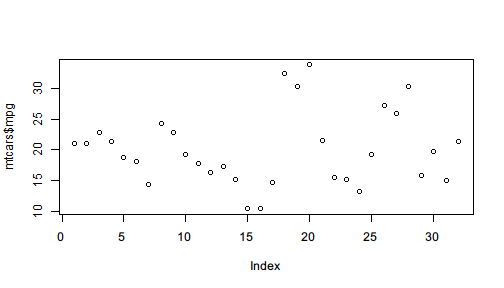
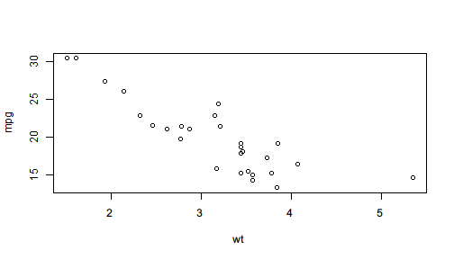

# Pipe for side effect

In a pipeline, one may be interested not only in the final outcome but sometimes also in intermediate results. In other words, as the operator pipes the value forward for streamlined processing, one may also want to save the intermediate result for further use, visualize the  intermediate values for better understanding, or print some message to indicate the progress.

However, if we directly call `plot()` or `cat()` in the middle of a pipeline, the pipeline will be broken because they return `NULL` or some other values undesired for further piping. 

For example, we draw a scatter plot and saves its returned value to `z`.


```r
z <- plot(mtcars$mpg)
```



```r
z
```

```
# NULL
```

It can be clearly seen that `plot()` does two things: 

1. Draw a scatter image of `mtcars$mpg`.
2. Return `NULL` value.

The first thing is often considered as *side-effect* because it is an influence the function has on the outside environment: it changes what to show in the graphics area. However, when we are building a pipeline and want to plot with some intermediate results, we only want the side effect and have to avoid the returned value, in this case, `NULL`, which is not the desired data we would like to further process.

`%>>%` provides a syntax to supports side effect piping. The syntax is called **one-sided formula** that starts with `~` to indicate that the right-hand  side expression will be evaluated only for its side-effect, its value will be ignored, and the input value will be returned instead.

For example, after subsetting `mtcars` by lower and upper quantile, if we want to see how many rows are left, we can use a one-sided formula to indicate side-effect.


```r
mtcars %>>%
  subset(mpg >= quantile(mpg, 0.05) & mpg <= quantile(mpg, 0.95),
    c(mpg, cyl, wt)) %>>%
  (~ cat("rows:",nrow(.),"\n")) %>>%   # cat() returns NULL
  summary
```

```
# rows: 28
```

```
#       mpg             cyl              wt       
#  Min.   :13.30   Min.   :4.000   Min.   :1.513  
#  1st Qu.:15.72   1st Qu.:4.000   1st Qu.:2.732  
#  Median :19.20   Median :6.000   Median :3.325  
#  Mean   :19.85   Mean   :6.214   Mean   :3.152  
#  3rd Qu.:21.82   3rd Qu.:8.000   3rd Qu.:3.570  
#  Max.   :30.40   Max.   :8.000   Max.   :5.345
```

To explain in detail, the syntax `(~ f(.))` tells the operator that `f(.)` on the right of `~` should only be evaluated for its side effect with `.` representing the input value, and the input value, i.e. the filtered `mtcars` should continue in the pipeline and be passed to `summary()`.

If `cat()` is directly called here, the code will not only fail because `%>>%` tries to pass the filtered data (a `data.frame`, which is essentially a `list`) to `cat()` and get rejected, but also become less readable because the data processing steps and side-effect steps are mixed to make it harder to distinguish really important lines.


```r
mtcars %>>%
  subset(mpg >= quantile(mpg, 0.05) & mpg <= quantile(mpg, 0.95),
    c(mpg, cyl, wt)) %>>%
  cat("rows:",nrow(.),"\n") %>>%   # cat() returns NULL
  summary
```

```
# Error: argument 1 (type 'list') cannot be handled by 'cat'
```

If you look back at the correct code with the side effect syntax, you may find it more readable because you can easily distinguish side effect expressions with other lines.

The design of `~ expression` syntax for side effect also makes one-sided formula **a branch** of the mainstream pipeline. Note that the design always emphasizes the mainstream pipeline and makes it easy to find out branch pipelines.

Another example is plotting in the middle of a pipeline as side effect.


```r
mtcars %>>%
  subset(mpg >= quantile(mpg, 0.05) & mpg <= quantile(mpg, 0.95)) %>>%
  (~ plot(mpg ~ wt, data = .)) %>>%    # plot() returns NULL
  lm(formula = mpg ~ wt) %>>%
  summary()
```



```
# 
# Call:
# lm(formula = mpg ~ wt, data = .)
# 
# Residuals:
#     Min      1Q  Median      3Q     Max 
# -3.9594 -1.7930 -0.2217  1.5782  5.6073 
# 
# Coefficients:
#             Estimate Std. Error t value Pr(>|t|)    
# (Intercept)  35.3059     1.9850  17.786 4.49e-16 ***
# wt           -4.9043     0.6108  -8.029 1.65e-08 ***
# ---
# Signif. codes:  0 '***' 0.001 '**' 0.01 '*' 0.05 '.' 0.1 ' ' 1
# 
# Residual standard error: 2.563 on 26 degrees of freedom
# Multiple R-squared:  0.7126,	Adjusted R-squared:  0.7016 
# F-statistic: 64.47 on 1 and 26 DF,  p-value: 1.652e-08
```

With `~`, side-effect operations can be easily distinguished from mainstream pipeline, and the input value of each line can be easily found by skipping the lines that start with `(~ ` while you are looking back.

If you feel ambiguous when using `.` in the side-effect expression, you can write a formula after `~`. The expression can be either an expression using `.` or a formula (lambda expression) using user-defined symbol. Therefore the first example can be rewritten like


```r
mtcars %>>%
  subset(mpg >= quantile(mpg, 0.05) & mpg <= quantile(mpg, 0.95),
    c(mpg, cyl, wt)) %>>%
  (~ filtered ~ cat("rows:",nrow(filtered),"\n")) %>>%   # cat() returns NULL
  summary
```

```
# rows: 28
```

```
#       mpg             cyl              wt       
#  Min.   :13.30   Min.   :4.000   Min.   :1.513  
#  1st Qu.:15.72   1st Qu.:4.000   1st Qu.:2.732  
#  Median :19.20   Median :6.000   Median :3.325  
#  Mean   :19.85   Mean   :6.214   Mean   :3.152  
#  3rd Qu.:21.82   3rd Qu.:8.000   3rd Qu.:3.570  
#  Max.   :30.40   Max.   :8.000   Max.   :5.345
```

An easier way to print the intermediate value is to use `(? expr)` syntax like asking a question. This also supports formula as lambda expression.


```r
mtcars %>>% 
  subset(vs == 1, c(mpg, cyl, wt)) %>>%
  (? nrow(.)) %>>%
  (? data ~ ncol(data)) %>>%
  summary
```

```
# ? nrow(.)
# [1] 14
# ? data ~ ncol(data)
# [1] 3
```

```
#       mpg             cyl              wt       
#  Min.   :17.80   Min.   :4.000   Min.   :1.513  
#  1st Qu.:21.40   1st Qu.:4.000   1st Qu.:2.001  
#  Median :22.80   Median :4.000   Median :2.623  
#  Mean   :24.56   Mean   :4.571   Mean   :2.611  
#  3rd Qu.:29.62   3rd Qu.:5.500   3rd Qu.:3.209  
#  Max.   :33.90   Max.   :6.000   Max.   :3.460
```
