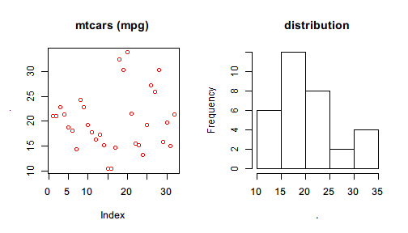
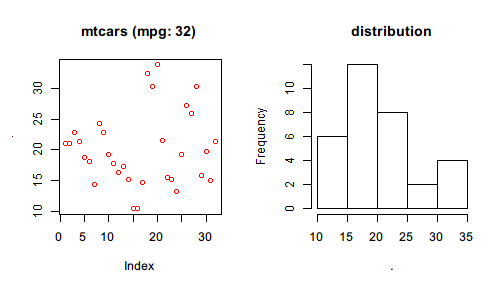

# Pipe to dot

Not all functions are pipe-friendly in every case: You may find some functions do not take your data produced by a pipeline as the first argument. In this case, you can enclose your expression by `{}` or `()` so that `%>>%` will use `.` to represent the value on the left and evaluate the enclosed expression.

For the linear model example, one can rewrite `lm(formula = )` to


```r
mtcars %>>%
  { lm(mpg ~ cyl + wt, data = .) }
```

```

Call:
lm(formula = mpg ~ cyl + wt, data = .)

Coefficients:
(Intercept)          cyl           wt  
     39.686       -1.508       -3.191  
```

or 


```r
mtcars %>>%
  { lm(mpg ~ cyl + wt, data = .) }
```

```

Call:
lm(formula = mpg ~ cyl + wt, data = .)

Coefficients:
(Intercept)          cyl           wt  
     39.686       -1.508       -3.191  
```

The difference between `{}` and `()` used above is

1. `{}` accepts more than one expressions within the braces and its value is determined by the last one; but `()` accepts only one expression.
2. `{}` has only one feature: pipe to `.` in the enclosed expression while `()` has more features (we will cover them soon).

To demonstrate the difference, we run the following examples.


```r
mtcars %>>% {
  model <- lm(mpg ~ wt + cyl, data = .)
  summ <- summary(model)
  summ[c("r.squared","adj.r.squared")]
}
```

```
$r.squared
[1] 0.8302274

$adj.r.squared
[1] 0.8185189
```

It shows that `{}` holds a code block whose value is determined by the last expression or interrupted by `return()`.


```r
mtcars %>>% 
  lm(formula = mpg ~ wt + cyl) %>>%
  summary %>>% {
    if(.$r.squared >= 0.8) {
      return("Model A")
    }
    cat("Model B should be considered.\n")
    "Model B"
  }
```

```
[1] "Model A"
```

One thing to notice is that `{}` is more flexible than previously demonstrated. It also allows using `%>>%` within the braces as well as causing side effect such as plotting graphics.


```r
mtcars %>>% {
  par(mfrow=c(1,2))
  .$mpg %>>% plot(col = "red", main="mtcars (mpg)")
  .$mpg %>>% hist(main = "distribution")
}
```

 

Another thing is that the meaning of nested dots are always determined by the working operator for that dot symbol. For example, the above code can be refined to


```r
mtcars %>>% {
  par(mfrow=c(1,2))
  .$mpg %>>% plot(col = "red", main=sprintf("mtcars (mpg: %d)",length(.)))
  .$mpg %>>% hist(main = "distribution")
}
```

 

It should be obvious that `.` below `par()` belong to the first `%>>%` that works with `mtcars` while `.` in `length()` belong to the operator that works with `.$mpg` so that it can correctly show the length of `mpg` (32) rather than that of `mtcars` (11).
